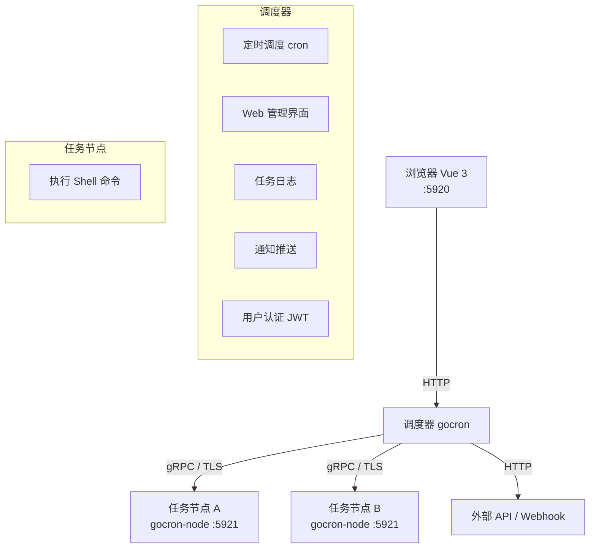
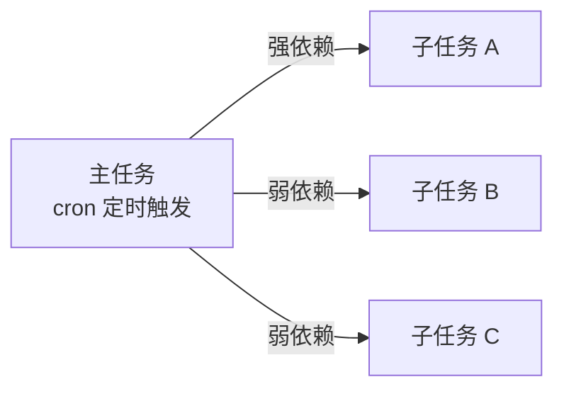

# GoCronX — 定时任务管理系统

轻量级分布式定时任务集中调度和管理系统，替代 Linux crontab。


---

## 目录

- [核心特性](#核心特性)
- [架构概览](#架构概览)
- [快速开始](#快速开始)
- [定时任务配置](#定时任务配置)
- [通知配置](#通知配置)
- [部署方式](#部署方式)
- [命令行参数](#命令行参数)
- [开发指南](#开发指南)
- [API 文档](#api-文档)
- [技术栈](#技术栈)

---

## 核心特性

| 类别      | 功能                                                                                         |
| --------- | -------------------------------------------------------------------------------------------- |
| 🕐 调度   | crontab 表达式精确到秒，支持主/子任务依赖（强依赖 / 弱依赖）                                 |
| 🔧 执行   | Shell 命令（远程节点执行） / HTTP 请求（调度器直接执行，支持 GET / POST）                    |
| 📦 HTTP   | POST 模式支持自定义 Headers、JSON / Form-Data / URL-Encoded 三种请求体，可粘贴整段 JSON 文本 |
| 🔄 容错   | 失败自动重试（次数 + 间隔均可配），超时强制终止，单实例运行互斥                              |
| 🔔 通知   | 邮件 / 飞书机器人 / 企业微信机器人 / Webhook，自定义模板 + 关键字触发                        |
| 👥 权限   | 多用户、管理员 / 普通用户角色，操作日志（登录日志、任务执行日志）                            |
| 📊 仪表盘 | 首页统计卡片（总任务数 / 运行中 / 24h 失败 / 在线节点），搜索 + 筛选 + 分页                  |

---

## 架构概览



- **调度器** 负责定时触发、分发命令、记录日志、发送通知
- **任务节点** 部署在目标机器上，通过 gRPC 接收调度器的命令并在本地执行 Shell
- HTTP 任务由调度器直接发起，无需任务节点

---

## 快速开始

### 环境要求

- **数据库**: MySQL 5.7+ / PostgreSQL 10+
- **调度器**: Windows / Linux / macOS
- **任务节点**（Shell 任务必须）: Linux / macOS / Windows

### 首次安装

1. **启动调度器**（任选一种方式）

   ```bash
   # 方式 1：源码运行
   make run

   # 方式 2：编译后运行
   make build
   ./bin/gocron web -e dev
   ```
2. **打开浏览器** `http://localhost:5920`
3. **跟随安装向导**完成初始化：

   - **数据库配置** — 填写 MySQL/PostgreSQL 连接信息
   - **管理员账号** — 创建第一个管理员账户
4. 安装完成后自动跳转登录页。

### 启动任务节点（可选，仅 Shell 任务需要）

在目标机器上下载或编译 `gocron-node`，然后执行：

```bash
# 编译
go build -o bin/gocron-node ./cmd/node

# 启动（默认监听 0.0.0.0:5921）
./bin/gocron-node

# 指定监听地址
./bin/gocron-node -s 192.168.1.100:5921

# 开启 TLS 加密通信
./bin/gocron-node -enable-tls \
  -ca-file /path/to/ca.pem \
  -cert-file /path/to/cert.pem \
  -key-file /path/to/key.pem
```

---

## 定时任务配置

### crontab 表达式

支持 **6 段式**（精确到秒）：

```
秒 分 时 日 月 周
```

| 表达式             | 含义                    |
| ------------------ | ----------------------- |
| `0 */5 * * * *`  | 每 5 分钟执行一次       |
| `0 0 2 * * *`    | 每天凌晨 2 点执行       |
| `0 0 4 * * 0`    | 每周日凌晨 4 点执行     |
| `0 30 9 1 * *`   | 每月 1 号上午 9:30 执行 |
| `*/30 * * * * *` | 每 30 秒执行一次        |

> 编辑任务时输入表达式会**实时预览**下一次及后续 5 次执行时间。

### 任务类型

#### Shell 任务

- 在**远程任务节点**上执行 Shell 命令
- 支持同时在多个节点上运行
- 需要在「任务节点」管理中注册主机

#### HTTP 任务

- 由调度器直接发起 HTTP 请求，**不依赖任务节点**
- 支持 GET / POST 两种方法
- POST 模式支持两种参数配置方式：
  - **JSON 文本模式** — 直接粘贴完整 JSON
  - **表单模式** — 逐条填写键值对，支持 Headers / Body 分离

### 主任务 & 子任务（任务依赖）



- **强依赖**: 主任务执行成功后才运行子任务
- **弱依赖**: 无论主任务成败，都运行子任务
- 子任务不直接配置 cron 表达式，由父任务触发

### 高级配置

| 参数         | 说明                                            | 默认值                |
| ------------ | ----------------------------------------------- | --------------------- |
| 超时时间     | 任务执行超过该秒数强制终止                      | 0（不限制）           |
| 单实例运行   | 前次未完成时是否跳过本次调度                    | 是                    |
| 失败重试次数 | 执行失败后重试 N 次，取值 0-10                  | 0（不重试）           |
| 重试间隔     | 每次重试之间的等待秒数，取值 0-3600             | 0（系统默认递增间隔） |
| 通知状态     | 不通知 / 失败时通知 / 总是通知 / 关键字匹配通知 | 不通知                |
| 通知类型     | 邮件 / 飞书 / 企业微信 / Webhook                | -                     |

---

## 通知配置

### 邮件

- 配置 SMTP 服务器、端口、账号密码
- 添加通知用户（用户名 + 邮箱）
- 支持 HTML 模板

### 飞书机器人

- 在飞书群中添加**自定义机器人**，获取 Webhook URL
- 可选配置**签名校验 Secret**
- 支持多群组管理
- 消息格式: 交互式卡片（Markdown）

### 企业微信机器人

- 在企业微信群中添加**群机器人**，获取 Webhook URL
- 支持多群组管理
- 消息格式: Markdown

### Webhook

- 自定义 POST URL
- 支持 JSON 模板，使用变量替换

### 通知模板变量

| 变量             | 说明         |
| ---------------- | ------------ |
| `{{TaskId}}`   | 任务 ID      |
| `{{TaskName}}` | 任务名称     |
| `{{Status}}`   | 执行结果状态 |
| `{{Result}}`   | 任务执行输出 |
| `{{Remark}}`   | 任务备注     |

---

## 部署方式

### 方式一：二进制部署（推荐）

```bash
# 下载对应平台的 Release 包
# https://github.com/ouqiang/gocron/releases

# 解压并启动调度器
tar -xzf gocron-v*.tar.gz
cd gocron-v*
./gocron web -p 5920
```

### 方式二：Docker

```bash
# 拉取镜像
docker pull ouqg/gocron

# 运行（需提前启动 MySQL 容器）
docker run --name gocron \
  --link mysql:db \
  -p 5920:5920 \
  -v /path/to/conf:/app/conf \
  -v /path/to/log:/app/log \
  -d ouqg/gocron
```

### 方式三：源码编译

```bash
# 克隆项目
git clone https://github.com/ouqiang/gocron.git
cd gocron

# 安装前端依赖并构建
cd web/vue3 && npm install && npm run build && cd ../..

# 构建完整项目（前端 + statik 嵌入 + Go 编译）
make build

# 启动
./bin/gocron web -e prod
```

### 方式四：Kubernetes

项目包含 `k8s-deploy/` 目录，可直接使用 kubectl 部署：

```bash
kubectl apply -f k8s-deploy/
```

### 生产环境建议

- 使用 **MySQL 5.7+** 推荐 InnoDB 引擎
- 在反向代理（Nginx/Caddy）后运行，开启 HTTPS
- 配置 `allow_ips` 限制管理端访问 IP
- 任务节点与调度器之间建议开启 TLS
- 定时备份数据库
- 日志写入文件并通过 `conf/app.ini` 配置日志级别为 `prod`

---

## 命令行参数

### gocron（调度器）

```
gocron web [选项]

  --host    监听地址（默认 0.0.0.0）
  -p        监听端口（默认 5920）
  -e        运行环境（dev | test | prod，默认 prod）
  -v        查看版本
  -h        查看帮助
```

### gocron-node（任务节点）

```
gocron-node [选项]

  -s          监听地址，格式 ip:port（默认 0.0.0.0:5921）
  -allow-root 允许以 root 用户运行（仅 *nix）
  -enable-tls 开启 TLS 加密
  -ca-file    CA 证书文件
  -cert-file  证书文件
  -key-file   私钥文件
  -v          查看版本
  -h          查看帮助
```

---

## 开发指南

```bash
# 1. 克隆项目
git clone https://github.com/ouqiang/gocron.git
cd gocron

# 2. 安装前端依赖
cd web/vue3 && npm install && cd ../..

# 3. 开发模式启动
# 终端 1 — 启动后端
make run

# 终端 2 — 启动前端（热重载，API 代理到 :5920）
make dev-vue3       # 访问 http://localhost:8080
```

### Makefile 常用命令

| 命令                 | 说明                                            |
| -------------------- | ----------------------------------------------- |
| `make build`       | 构建前端 + statik 嵌入 + 编译调度器和节点二进制 |
| `make run`         | `make build` + 启动服务                       |
| `make gocron`      | 仅编译调度器                                    |
| `make node`        | 仅编译任务节点                                  |
| `make build-vue3`  | 构建 Vue 3 前端 + statik 嵌入                   |
| `make dev-vue3`    | 启动前端 Vite 开发服务器（热重载）              |
| `make test`        | 运行 Go 测试                                    |
| `make package`     | 打包当前平台的发布包                            |
| `make package-all` | 打包 Windows / Linux / macOS 全平台包           |
| `make clean`       | 清理构建产物（bin/ / dist/ / node_modules/）    |
| `make lint`        | 运行 golangci-lint                              |

### 项目结构

```
gocron/
├── cmd/
│   ├── gocron/          # 调度器入口
│   └── node/            # 任务节点入口
├── internal/
│   ├── models/          # 数据模型 & 迁移
│   ├── modules/
│   │   ├── notify/      # 通知模块（邮件/飞书/企微/Webhook）
│   │   ├── rpc/         # gRPC 通信
│   │   ├── setting/     # 配置管理
│   │   └── ...
│   ├── routers/         # HTTP 路由 & 中间件
│   ├── service/         # 定时调度核心逻辑
│   └── statik/          # 前端静态资源嵌入
├── web/
│   └── vue3/            # Vue 3 + Element Plus 前端
│       └── src/
│           ├── pages/   # 页面组件
│           ├── components/  # 全局组件
│           ├── router/  # 路由配置
│           ├── stores/  # Pinia 状态管理
│           └── api/     # API 封装
├── k8s-deploy/          # Kubernetes 部署文件
├── Dockerfile           # Docker 构建文件
├── makefile             # 构建脚本
└── go.mod
```

---

## API 文档

### 认证

所有 API（除登录 / 安装外）需在 Header 中携带 JWT：

```
Auth-Token: <token>
```

登录接口返回 token，前端自动附加。

### 主要接口

| 方法 | 路径                      | 说明                     |
| ---- | ------------------------- | ------------------------ |
| GET  | `/api/install/status`   | 安装状态                 |
| POST | `/api/install/store`    | 执行安装                 |
| POST | `/api/user/login`       | 用户登录                 |
| GET  | `/api/task`             | 任务列表（支持筛选分页） |
| GET  | `/api/task/:id`         | 任务详情                 |
| POST | `/api/task/store`       | 创建/更新任务            |
| POST | `/api/task/enable/:id`  | 激活任务                 |
| POST | `/api/task/disable/:id` | 暂停任务                 |
| GET  | `/api/task/run/:id`     | 手动执行一次             |
| GET  | `/api/task/log`         | 任务执行日志             |
| GET  | `/api/dashboard/stats`  | 仪表盘统计数据           |
| GET  | `/api/host`             | 主机列表                 |
| GET  | `/api/system/mail`      | 邮件配置                 |
| GET  | `/api/system/feishu`    | 飞书配置                 |
| GET  | `/api/system/wecom`     | 企业微信配置             |
| GET  | `/api/system/webhook`   | Webhook 配置             |
| GET  | `/api/system/login-log` | 登录日志                 |

---

## 技术栈

| 组件     | 技术                                         |
| -------- | -------------------------------------------- |
| 后端框架 | [Macaron](https://go-macaron.com/)            |
| 定时调度 | [Cron](https://github.com/robfig/cron)        |
| ORM      | [Xorm](https://xorm.io/)                      |
| 数据库   | MySQL / PostgreSQL                           |
| RPC      | [gRPC](https://grpc.io/)                      |
| 认证     | JWT                                          |
| 前端框架 | [Vue 3](https://vuejs.org/) (Composition API) |
| UI 框架  | [Element Plus](https://element-plus.org/)     |
| 构建工具 | [Vite](https://vitejs.dev/)                   |
| 状态管理 | [Pinia](https://pinia.vuejs.org/)             |
| 前端嵌入 | [Statik](https://github.com/rakyll/statik)    |

---

## 更新日志

### v2.0

- 前端全面升级至 **Vue 3 + Element Plus + Vite**
- 全新 **仪表盘首页**：统计卡片 + 任务列表整合
- 新增 **crontab 实时预览**（输入表达式即显示下次执行时间）
- 新增 **HTTP POST 请求参数配置**（JSON 文本 / 表单双模式）
- 新增 **飞书机器人** + **企业微信机器人** 通知
- 全新独立**全屏登录页** + **安装向导**
- 通知类型调整：移除 Slack，Webhook 移至 type=4
- 分页组件重构，清爽风格
- 优化移动端适配

### v1.5

- 前端 Vue + Element UI 重构
- 新增 WebHook 通知、自定义模板、关键字匹配通知
- 任务列表显示下次执行时间

### v1.4

- HTTP 任务支持 POST 请求
- 支持手动停止运行中的 Shell 任务
- 重试间隔自定义

### v1.3

- 多用户登录 + 权限控制

### v1.2.2

- 图形验证码、旧版本升级、批量操作、HTTPS 双向认证

### v1.1

- 多节点并发执行、父子任务依赖、占位符变量
